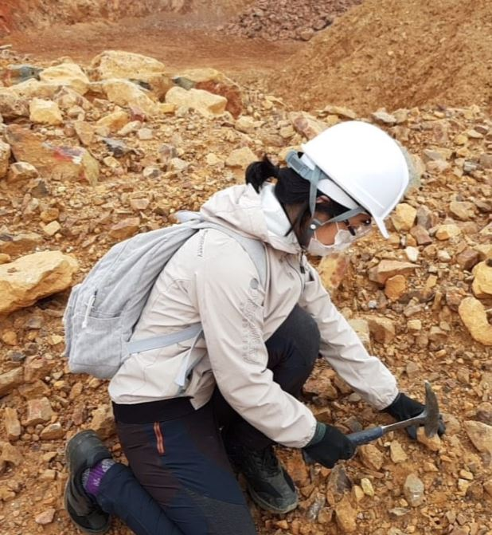

# Hyun Joo Lee

## Education

> [**Columbia University**](https://www.columbia.edu/)
> - Sept. 2021 –
> -*New York city, New York, United States*

> [**Inha University**](http://eng.inha.ac.kr)
> - Sept. 2018 – Feb. 2021
>- Master of Energy and Resources Engineering
>-*Incheon, Korea*

> [**Korea University** ](http://www.korea.edu/mbshome/mbs/en/index.do)              
> - Mar. 2014 – Aug. 2018
>- Bachelor of Earth and Environmental Science
>- *Seoul, Korea*

>[**University of Texas, Austin**](https://www.utexas.edu/)
>- Jan. 2017 – Jun. 2017
>- Exchange student in Geological Sciences                          
>- *Austin, Texas, United States*

## Research interests
- Carbon isotope evaluation during volcanic gas decompression
- Isotope geochemistry / Volcanology / Petrology